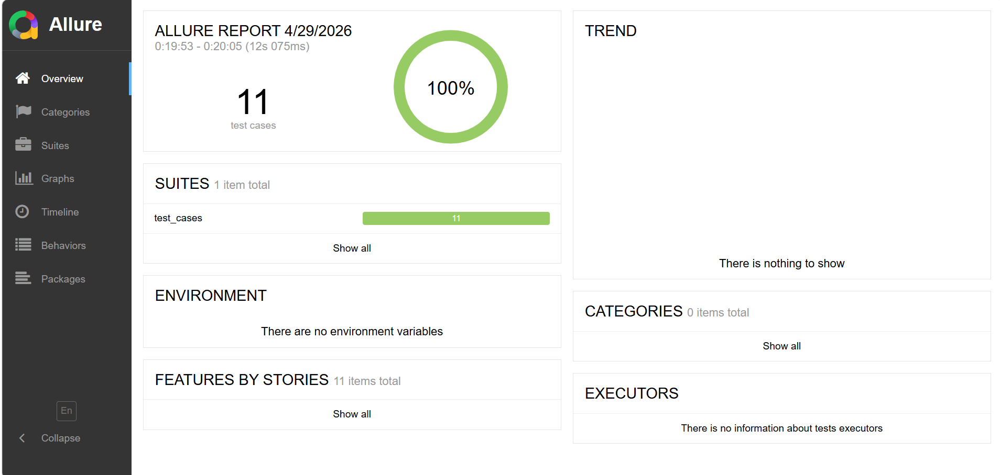
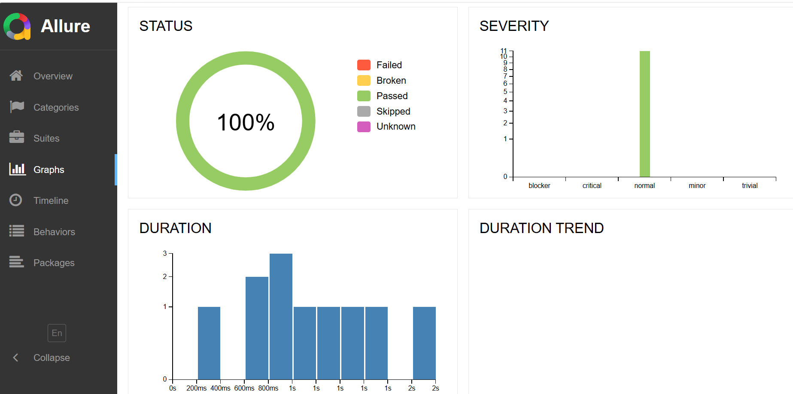
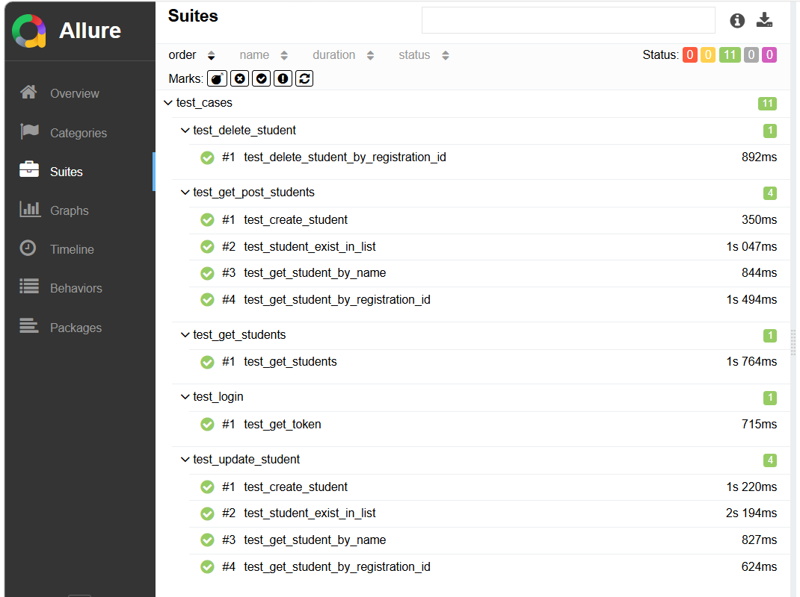
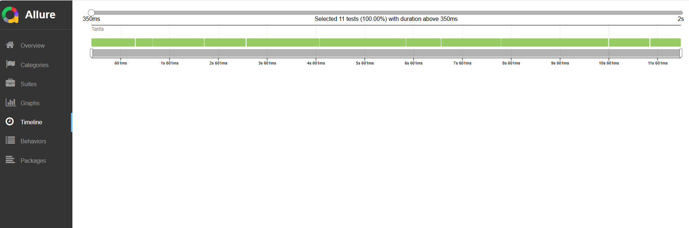

# Robust REST API Automation Suite with Pytest & Allure 🚀

[](https://www.python.org/downloads/)
[](https://docs.pytest.org/)
[](https://docs.qameta.io/allure/)

This is a professional-grade API automation framework built to ensure high-quality RESTful service validation. It uses **Python**, **Pytest**, and **Allure Reports** to provide a scalable and highly visual testing experience.

---

## 📊 Test Execution Dashboards

### Allure Overview
Below is the high-level summary of the test execution results, showcasing the pass/fail ratio and overall test health.


### Graphical Analysis
Visual representation of test severity, duration, and status trends.


### Category & Suite Breakdown
Detailed view of test cases organized by their functional categories and suites.


### Execution Timeline
A visual timeline showing when each test was executed and how long it took.


---

## 🌟 Project Key Features
*   **Comprehensive API Testing**: Validates REST endpoints for status codes, response bodies, and headers.
*   **Modular Framework**: Separated logic for `test_cases` and `utils` for better maintainability.
*   **Rich Reporting**: Advanced reporting with screenshots, steps, and graphs using Allure.
*   **Configurable**: Easy management of environment settings via `pytest.ini`.

## 📂 Directory Structure
```text
├── assets/             # Project screenshots and visual reports
├── test_cases/         # Functional API test scripts
├── utils/              # Helper functions and reusable API wrappers
├── pytest.ini          # Global configuration for Pytest
├── requirements.txt    # Project dependencies
└── README.md           # Project documentation
```

## 👩‍💻 Author
**Israt Jahan Tarifa**
[](https://www.linkedin.com/in/israt-tarifa/) 
[](https://github.com/Israt-Tarifa)
